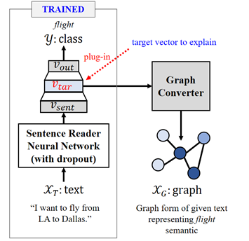
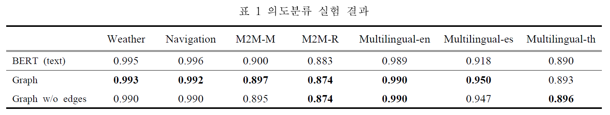
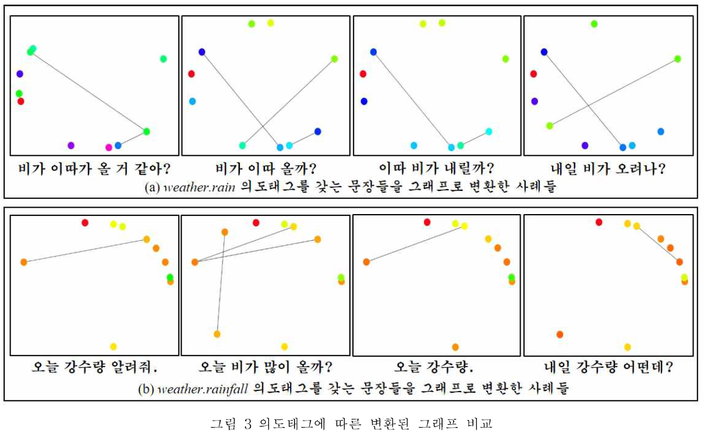

# Vector2Graph_pl
제 32회 한글 및 한국어 정보처리 학술대회의 논문집에 출판된 "심층신경망 언어이해에서의 벡터-그래프 변환 방법을 통한 설명가능성 확보에 대한 연구"에 대한 코드입니다.

## Vector2Graph

**Vector2Graph**는 딥러닝 기반의 자연어 이해 기술들에 대한 내적인 동작들과 결정에 대한 근거를 설명하기 위해 만들어진 프레임워크입니다. 



* **Vector2Graph**에서는 벡터를 그래프로 변환하는 방법을 제안하고 그래프의 구성요소인 노드 및 엣지의 결정을 위한 **EI-ISI(Element-Importance Inverse-Semantic-Importance)** 점수와 **EEC(Element-Element-Correlation)** 점수를 심층신경망의 훈련방법 중 하나인 **드랍아웃(Dropout)을 통해** 계산하는 방법을 제안합니다.
* 자연어 처리에서의 의도 분류 실험과 그래프 이미지에 대한 실험을 통해, 본 연구에서 제안한 **벡터-그래프(Vector2Graph) 변환 프레임워크**가 성공적으로 벡터의 의미정보를 유지하면서도, 설명 가능한 그래프를 생성함을 보입니다.
* 해당 코드는 [PyTorch Lightning](https://www.pytorchlightning.ai/)의 코드 스타일로 작성되었습니다.

## Dependencies
* torch==1.9.0
* transformers>=4.2.0
* pytorch-lightning==1.3.8
* networkx
* matplotlib
* numpy
* pandas

## Usage
### 1. 데이터 준비
* `data/DOMAIN_NAME/` 경로에 json 형태로 된 자연어 이해 데이터를 준비합니다.(실험에 사용한 데이터셋은 저작권 문제로 인해 제공하지 않습니다.)
* `data/` 경로에서 다음과 같은 명령을 실행하여 실험을 위한 전처리된 데이터를 준비합니다.
```bash
python 99_build_all.py --domain weather
```

### 2. [TEXT] BERT 기반의 의도분류 모델 훈련
* 의도분류 실험을 위한 기본 Text Reader를 훈련시킵니다.
```bash
python run_intent_classification.py --domain weather --do_train --text_reader bert
```

### 3. Vector Movement Generator
* 드롭아웃(Dropout)을 통해 Perturbated Vector Movement를 생성합니다.
* 이 때, `num_samples`는 드롭아웃을 통해 섭동을 일으킬 샘플 벡터의 개수를 의미합니다. 즉, `num_samples`는 같은 입력 벡터에 대해 복제(Duplicate)되는 수를 의미합니다. 이를 통해 생성된 샘플들은 같은 입력 값을 가짐에도 드롭아웃에 의해 미묘하게 그 값이 달라지게 됩니다.
```bash
python run_intent_classification.py --domain weather --do_test_and_dump --text_reader bert --num_samples 50
```

### 4. Vector To Graph Converter
* 이전 과정에서 생성된 Vector Movement를 그래프 이미지 형태로 변환합니다.
* `top_n`은 그래프를 생성하기 위한 노드(Node)의 수를 의미합니다.
* 또한, `need_edges` 옵션을 이용하면 그래프의 엣지(Edge)가 표현되고 이용하지 않으면 엣지는 표현되지 않습니다.
```bash
python vector2graph_converter.py --domain weather --text_reader bert --num_samples 50 --rep_type graph --need_edges --top_n 10
```

### 5. [Image] CNN 기반의 그래프 이미지 분류 실험
* 다음과 같은 명령어를 통해 이전 과정에서 생성된 그래프 이미지를 이용하여 의도분류 실험을 할 수 있습니다.
* 이미지 분류에 사용한 모델은 기본 CNN(Convolutional Neural Network)를 사용했습니다.
* **이미지 분류의 결과가 텍스트를 통한 분류 결과와 성능적으로 비슷하다면 올바르게 변환되었다고 이해할 수 있습니다.**
```bash
python image_intent_classification.py --domain weather --do_train --do_test --image_reader cnn --num_samples 50 --need_edges --base_text_reader bert --rep_type graph --top_n 10
```

## Experiment Results


## Example of Vector2Graph


## Citation
이 라이브러리를 프로젝트 및 연구에 적용하는 경우, 아래와 같이 인용 부탁드립니다.
```
@misc{vector2graph,
  author = {Se-Hun Hu, Sangkeun Jung},
  title = {Vector2graph : A Vector-to-Graph Conversion Framework for Explainable Deep Natural Language Understanding},
  year = {2020},
  publisher = {제 32회 한글 및 한국어 정보처리 학술대회 논문집}
}
```
